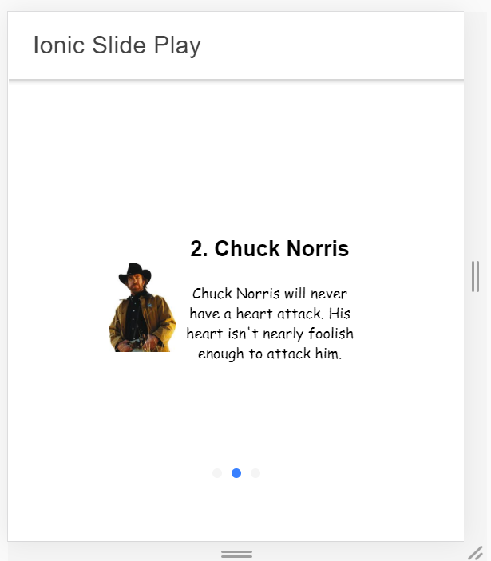

# ionic-play

A sample project to demonstrate ionic slides with zoom capability. Each of the slide in the sildes got an image and some texts as sample data.

# Develop

- Clone the repo
- Browse to `ionic-play` folder
- Do `npm install`
- Browse to `myApp` folder
- Do `ionic serve`

Access the app @ [http://localhost:8100](http://localhost:8100/home)

# App Look
Here is how the app looks at a glance:

# Contact
- [tapas.adhikary@gmail.com](tapas.adhikary@gmail.com)

  | |

- [greenroots2019@gmail.com](mailto:greenroots2019@gmail.com)

© [Greenroots Info](mailto:https://blog.greenroots.info)
